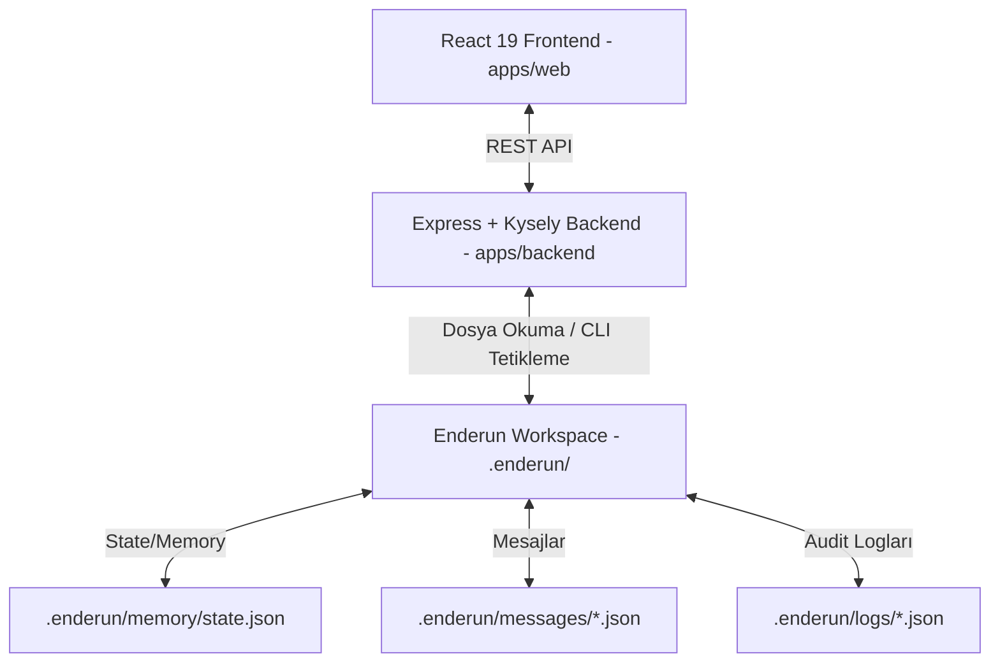

# 📋 Hermes Control Center — Project Specification

Bu doküman, Agent Enderun çerçevesi üzerinde geliştirilecek olan **Hermes Control Center (Enderun Yönetişim Konsolu)** uygulamasının fonksiyonel ve teknik özelliklerini tanımlar.

---

## 1. Problem Tanımı ve Bağlam
Yapay zeka ajanları (`@manager`, `@backend`, `@frontend` vb.) yazılım projelerini otonom olarak geliştirirken kendi aralarında asenkron mesajlaşır ve belirli aşamalarda insan onayına ihtiyaç duyarlar. Geliştiricilerin veya denetçilerin CLI komut satırına bağımlı kalmadan; ajanların durumlarını izleyebileceği, onay bekleyen işlemleri kolayca onaylayabileceği ve kod uyumluluğunu (compliance) denetleyebileceği merkezi bir grafik arayüz (dashboard) gereksiniminden dolayı bu proje tasarlanmıştır.

---

## 2. Fonksiyonel Gereksinimler

### A. Ajan Durum Ekranı (Agent Monitor)
*   Sistemdeki 13 ajanın aktif durumlarını listeler (`READY`, `EXECUTING`, `WAITING`, `TIMEOUT`, `BLOCKED`).
*   Her ajanın üzerinde çalıştığı aktif görevin açıklamasını ve Trace ID (ULID) bilgisini gösterir.
*   Timeout durumuna düşen ajanlar için manüel resetleme butonları sunar.

### B. Hermes Mesaj Akışı Görselleştirici (Hermes Broker View)
*   Ajanların birbirine gönderdiği `ACTION`, `DELEGATION`, `SUBTASK`, `REPLY` ve `ALERT` mesajlarını gerçek zamanlı veya polling yöntemiyle listeler.
*   Trace ID bazlı arama ve filtreleme sunarak bir görevin ajanlar arasında nasıl delege edildiğini görsel bir ağaç yapısı (Collaboration Graph) şeklinde sunar.

### C. İnsan Onayı Merkezi (Human-in-the-Loop Approval Center)
*   Ajanların talep ettiği ve yönetici onayı gerektiren işlemleri (`ALERT` ve `requiresApproval: true` olan aksiyonlar) listeler.
*   Onay bekleyen işlemlerin gerekçesini, talep eden ajanı ve Trace ID bilgisini gösterir.
*   Kullanıcının panel üzerinden "Onayla" butonuna basmasıyla arka planda `agent-enderun approve [traceId]` komutunu tetikler.

### D. Uyumluluk ve AST Denetim Paneli (Compliance Audit Panel)
*   Projedeki kod dosyalarında kurulan anayasal uyumluluk hatalarını listeler:
    *   TypeScript dosyalarındaki `any` veri tipi kullanımları.
    *   Yasaklı `console.log` kullanımları.
    *   Çözülmemiş `TODO` ve `FIXME` ifadeleri.
*   Dosya yolu ve satır numarası belirterek hataların yerini raporlar.

---

## 3. Mimari ve Veri Akışı



1.  **Veri Okuma:** Backend, `.enderun/memory/state.json`, `.enderun/memory/status.json` ve `.enderun/messages/` dizinindeki aktif JSON dosyalarını izler ve API üzerinden Frontend'e sunar.
2.  **Aksiyon Tetikleme:** Frontend üzerinden onay verildiğinde, Backend yerel bir child process başlatarak `agent-enderun approve [traceId]` komutunu çalıştırır.
3.  **AST Analizi:** Backend, `src/cli/utils/compliance.ts` içindeki `scanProjectCompliance()` algoritmasını kullanarak projeyi düzenli tarar ve uyumluluk verilerini API üzerinden raporlar.

---

## 4. Dizin Yapısı

```
agent-enderun/
├── apps/
│   ├── web/                     # React 19 Frontend Uygulaması
│   │   ├── src/
│   │   │   ├── components/      # UI Bileşenleri (Panda CSS)
│   │   │   ├── hooks/           # Ajan veri çekme hook'ları
│   │   │   └── main.tsx
│   │   └── package.json
│   └── backend/                 # Node.js Express Backend
│       ├── src/
│       │   ├── controllers/     # API Kontrolcüleri
│       │   ├── services/        # Dosya izleme ve CLI tetikleme servisleri
│       │   └── index.ts
│       └── package.json
```
